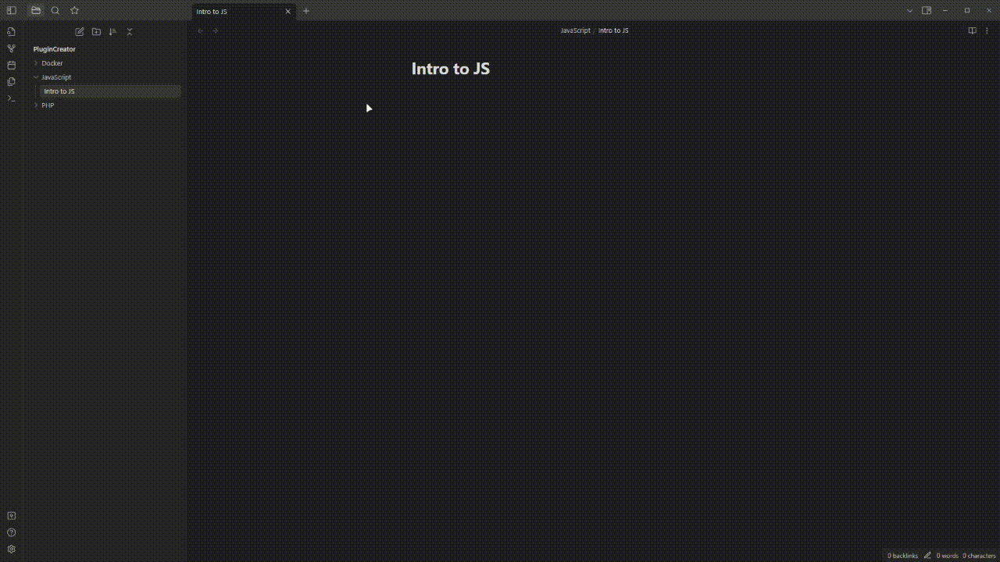
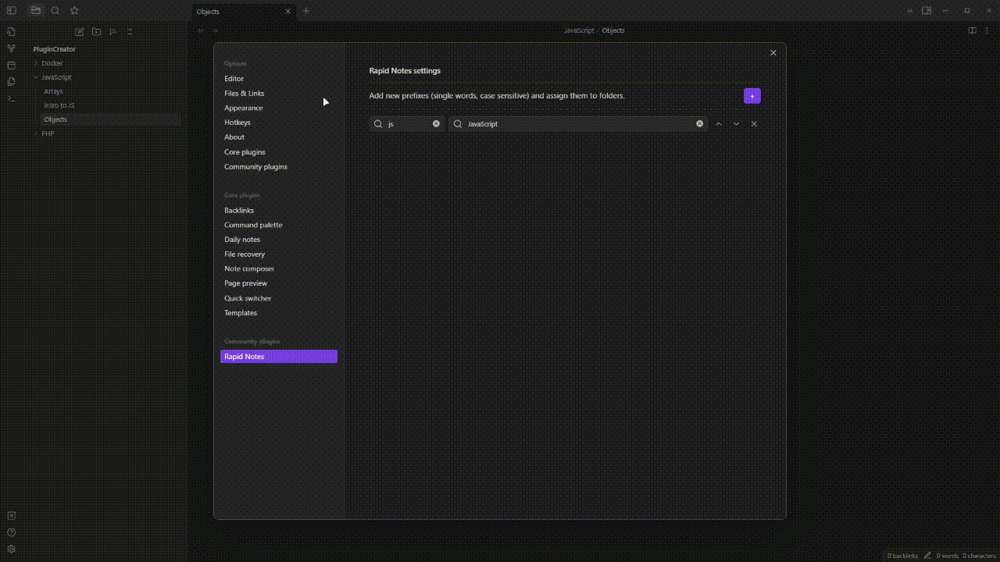

# Rapid Notes Plugin

Place notes in specific folders at the moment of creation using the prefixes defined in settings.

## How to use

In the plugin settings add prefix/folder pairs, considering prefixes must be single words and are case sensitive. Each prefix and folder can be used a single time. When you run the `Rapid Notes: New note` command (which can be binded to a new hotkey or replace the default "Create New Note" hotkey) if you input the prefix previously set, it's going used to create a new note using the input value without the prefix as name. If no prefix matches, a folder suggest is open. If your input begins with a slash `/` then the prefix will be ignored and you will always be prompted with a folder suggester.

## Example of basic usage

If you have a folder named `JavaScript` in your vault where you save all notes regarding JavaScript, you could add in the Rapid Notes settings the prefix `js` and assign it to said folder. Upon triggering the command to create a new note, you could enter into the prompt `js Promises` and a new file named `Promises` will be saved into the `JavaScript` folder.

## Example of escaped prefix

If you have your `js` prefix set, but you wish to create a new file named `js rulez`, then you can simply input `/js rulez` into the prompt and you will be prompted to select where to create the new file.

## Considerations

- You can combine Rapid Notes with [Templater plugin](https://github.com/SilentVoid13/Templater) to speed up your workflow even further, assigning templates for folders and enabling the setting to trigger Templater on file creation.
- I considered creating a special prefix for adding quick notes into an Inbox folder (or vault root) without being prompted with the folder suggester, but for now I'm just using the default new note functionatlity and setting the inbox folder as the "Default location for new notes".